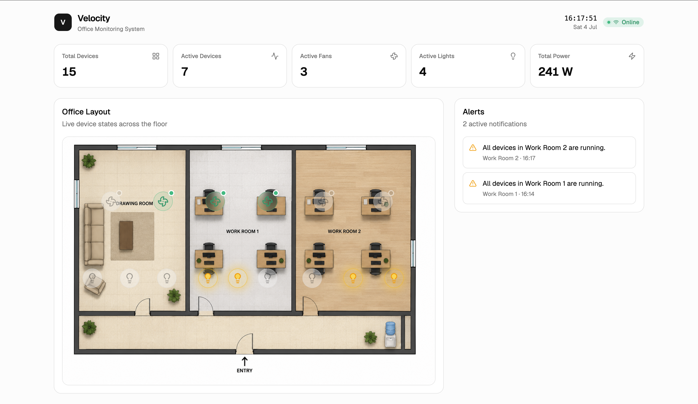
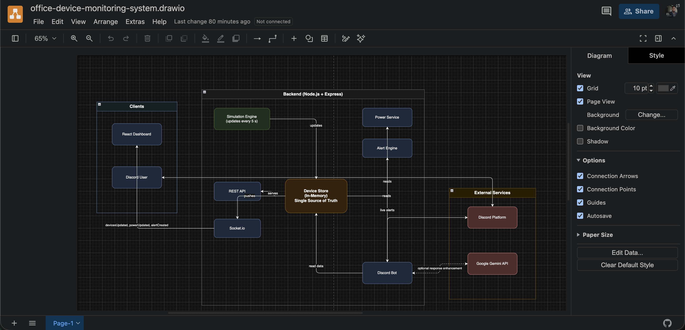
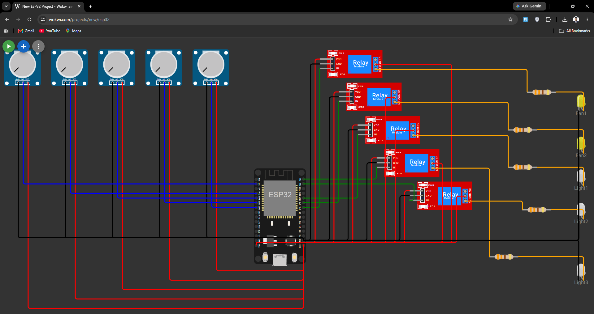
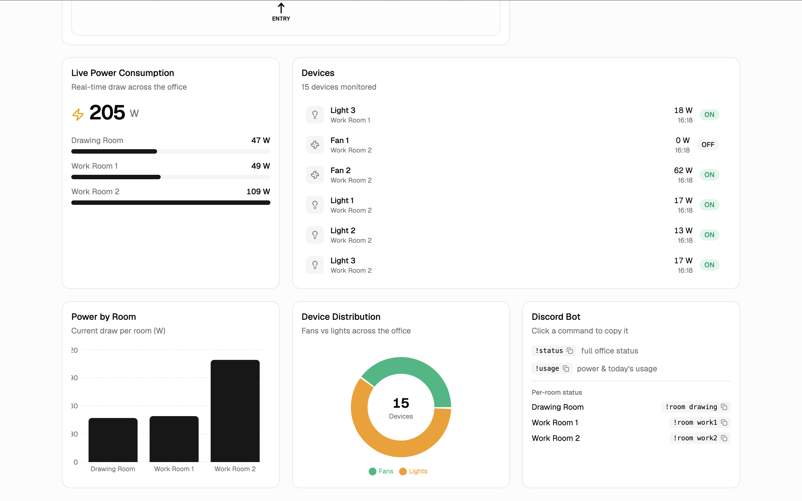
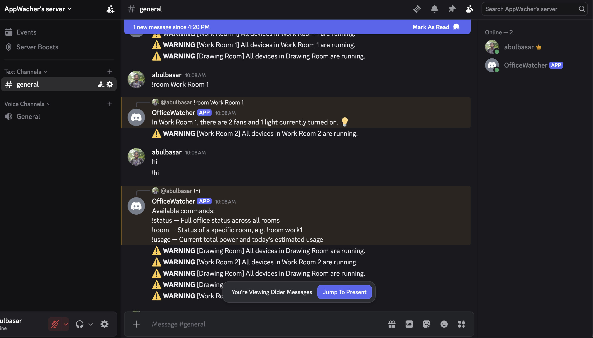
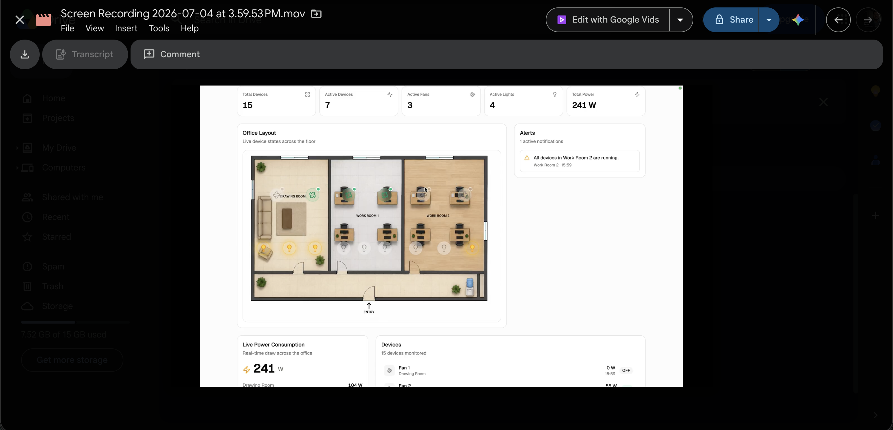

# IoT Office Monitoring System

> **Live Demo:** [https://iut-hackathon-velocity.vercel.app](https://iut-hackathon-velocity.vercel.app/)

A real-time, **read-only** monitoring platform for a smart office. There are **no
real IoT devices** — a backend service **simulates** them, calculates power usage,
raises alerts, and streams everything live to a web dashboard over Socket.io. An
optional, LLM-assisted **Discord bot** lets you query office status from chat.

Built for a hackathon, but architected cleanly so real devices, a database, and
more integrations can be added later without rewrites.



---

## The Office

| Room          | Devices              |
| ------------- | -------------------- |
| Drawing Room  | 2 fans + 3 lights    |
| Work Room 1   | 2 fans + 3 lights    |
| Work Room 2   | 2 fans + 3 lights    |

**15 devices total.** Each has a status (ON/OFF), current power draw, room, and
last-changed timestamp.

---

## System Architecture



> 📐 [View / Download full architecture diagram (Google Drive)](https://drive.google.com/file/d/1m3ZN0V8mEsxE-e_7NSsPz1dQZhH9ZFIQ/view)

### Hardware / Electrical Schematic



> 🔌 [View / Download hardware schematic (Google Drive)](https://drive.google.com/file/d/1HcfKdvwNvdMNpbM4zAZpedssS3ojP37T/view?usp=sharing) · [Live interactive diagram on Wokwi](https://wokwi.com/projects/468619032049339393)
>
> *Designed with [Wokwi](https://wokwi.com)*

Three cooperating parts:

1. **Backend** (`/backend`) — Express + Socket.io. Simulates devices in memory,
   computes power, raises alerts, exposes REST + WebSocket, and hosts the Discord bot.
2. **Frontend** (`/frontend`) — React + Vite dashboard that renders the office
   layout, device states, power, alerts, and charts, updating live.
3. **Discord bot** (inside the backend) — `!status`, `!room`, `!usage` commands and
   live alert notifications, phrased by an LLM when configured.

---

## Tech Stack

| Layer     | Technologies                                                          |
| --------- | --------------------------------------------------------------------- |
| Frontend  | React 19, Vite, TypeScript, Tailwind v4, shadcn/ui, Recharts, Socket.io client, React Hook Form, Zod |
| Backend   | Node.js, Express 5, TypeScript, Socket.io, Zod                        |
| Bot / LLM | discord.js, Google Gemini                                             |

No database — all state is in memory.

---

## Repository Layout

```
.
├── backend/     # simulation, REST API, Socket.io, Discord bot  → see backend/README.md
├── frontend/    # React dashboard                               → see frontend/README.md
└── README.md    # you are here
```

Each package has its own detailed README. This document is the quickstart and
the big picture.

---

## Quickstart (run everything)

**Prerequisites:** Node.js 20+ and npm.

### 1. Backend

```bash
cd backend
npm install
cp .env.example .env      # core service needs no edits; Discord/LLM optional
npm run dev               # http://localhost:6006
```

### 2. Frontend (in a second terminal)

```bash
cd frontend
npm install
npm run dev               # http://localhost:5173
```

Open the frontend URL. The dashboard header should read **Online**, and devices,
power, and alerts should update every ~5 seconds.

### 3. Discord bot (optional)

Add to `backend/.env`, then restart the backend:

```
DISCORD_BOT_TOKEN=your-bot-token
DISCORD_ALERT_CHANNEL_ID=your-channel-id   # for live alerts
GEMINI_API_KEY=your-gemini-key             # for natural-language replies
```

Full Discord setup (intents, invite URL) is in `backend/README.md`.

---

## What You Can Do

- **Watch the dashboard** update in real time — device toggles, power draw, alerts.
- **Query the REST API**: `GET /api/devices`, `/api/power/summary`, `/api/alerts`.
- **Use the bot** in Discord: `!status`, `!room work1`, `!usage`.
- **Receive live alerts** in a Discord channel (after-hours usage, whole room on,
  high power).

---

## Screenshots

### Statistics & charts


### Discord bot


> 🤖 **Try it live:** [Join the Discord server](https://discord.gg/67DRnN7af), go to the **#general** channel, and type `!status`, `!room work1`, or `!usage` to get real-time office status from the bot.

---

## Ports & Configuration

| Service   | Default URL             | Key env vars                                 |
| --------- | ----------------------- | -------------------------------------------- |
| Backend   | `http://localhost:6006` | `PORT`, `CLIENT_ORIGIN`, `DISCORD_*`, `GEMINI_API_KEY` |
| Frontend  | `http://localhost:5173` | `VITE_SOCKET_URL`                            |

The backend's `CLIENT_ORIGIN` and the frontend's `VITE_SOCKET_URL` must point at
each other. Defaults are pre-wired for local development.

---

## Security

- Secrets live only in `backend/.env` (gitignored) — **never committed**. Only
  `.env.example` (placeholders) is tracked.
- No secrets belong in the frontend: any `VITE_`-prefixed variable is bundled into
  the public client JS.
- If a Discord token or API key is ever exposed, **rotate it**.

---

## Design Principles

- **Single source of truth** — the in-memory device store; services read/derive,
  controllers stay thin.
- **Decoupled via observers** — simulation, sockets, alerts, and the bot are wired
  through `onChange` / `onAlert` rather than direct dependencies.
- **Swap seams for the future** — real IoT/MQTT devices, PostgreSQL/Prisma, Redis,
  and authentication can replace individual modules without touching the rest.
- **LLM never invents data** — the bot computes exact facts first; the model only
  rephrases them, with a deterministic fallback.

---

## Video Explanation

[](https://drive.google.com/file/d/17p4p4XLER55bBewBg7gljuSjJ-5zcALI/view?usp=sharing)

> 🎬 [Watch the full video explanation (Google Drive)](https://drive.google.com/file/d/17p4p4XLER55bBewBg7gljuSjJ-5zcALI/view?usp=sharing)

---

## Documentation

- **Backend:** [`backend/README.md`](./backend/README.md) — API reference,
  Socket.io events, Discord setup, and a full testing guide.
- **Frontend:** [`frontend/README.md`](./frontend/README.md) — structure, realtime
  data flow, routes, and testing.
